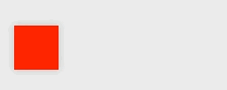

Let's talk about the current state of animations on OS X. We'll go through the best approaches for getting the best performance out of standard animations, and the hacks needed to go beyond basic animations.

### No layers

The most basic of animations on OS X is driven through the use of `NSAnimationContext` with no layer-backed views. Here's how we'd animate our view to the right:

```objectivec
[NSAnimationContext runAnimationGroup:^(NSAnimationContext *context) {
    context.duration = 2.f;
    view.animator.frame = CGRectOffset(view.frame, 100, 0);
} completionHandler:nil];
```

This is not ideal for many reasons. Since the view is not layer-backed, AppKit will drive this animation on the *main thread* by repeatedly calling `-setFrame:`, or in this case `-setFrameOrigin:`. Animation performance for larger numbers of views using this approach degrades extremely quickly. Your animations will not be smooth. **Don't do this**.

### Layer-backing

So we don't want our animations to be driven on the main thread. What's the alternative? Well we can simply turn on Core Animation by telling our view we want it to have a layer.

However, this might not be enough. It's extremely important to note that `NSView` has a property called `layerContentsRedrawPolicy` that dramatically effects the quality of your animations. This property specifies the behavior for view redrawing when animating, and was introduced in 10.6. In OS X 10.7 there were changes under the hood, and the value of the property actually affected how views are animated. [The documentation for this property](https://developer.apple.com/library/mac/documentation/cocoa/reference/applicationkit/classes/NSView_Class/Reference/NSView.html#//apple_ref/occ/instm/NSView/setLayerContentsRedrawPolicy:) is fantastic, and it would be a good idea to give it a quick read before we continue.

The most important fact to understand about this property is as follows: if your layer contents redraw policy is set to `NSViewLayerContentsRedrawDuringViewResize`, *which is the default*, your animation performance will likely suffer. In fact, it might even approach the same level of performance you get from not having a layer, as AppKit is still going to call `-setFrame:` on your view to drive the animation. Depending on how you want your view to redraw, a good redraw policy to use is likely `NSViewLayerContentsRedrawOnSetNeedsDisplay`.
If you set it to the aforementioned redraw policy, the view will be animated using Core Animation, which means the animation will be driven on a dedicated background thread. This will produce smooth animations in most cases.

Note that some `NSView` subclasses (such as `NSTextField`) will set the contents policy to the correct redraw policy by default. Check the documentation for more details on whether this is the case, or simply do some introspection on a view in question to see what it's redraw policy is.

```objectivec
// Tell the view to create a backing layer.
view.wantsLayer = YES;

// Set the layer redraw policy. This would be better done in the initialization method of a NSView subclass instead of here.
view.layerContentsRedrawPolicy = NSViewLayerContentsRedrawOnSetNeedsDisplay;

[NSAnimationContext runAnimationGroup:^(NSAnimationContext *context) {
    context.duration = 2.f;
    view.animator.frame = CGRectOffset(view.frame, 100, 0);
} completionHandler:nil];
```

Alternatively, since we now have a layer we can drop down a bit further past implicit animations to interact with Core Animation directly.

```objectivec
// ... same setup as above

CGRect frame = CGRectOffset(view.frame, 100, 0);

CABasicAnimation *animation = [CABasicAnimation animationWithKeyPath:@"position"];
animation.fromValue = [NSValue valueWithPoint:view.frame.origin];
animation.toValue = [NSValue valueWithPoint:frame.origin];
animation.duration = 2.f;

[view.layer addAnimation:animation forKey:animation.keyPath];
view.layer.position = frame.origin;
```

However, using Core Animation directly to animate common properties has some *significant* issues.

### The problem with layer-backed views

If you want to perform animations on the layer beyond setting common `NSView` cover methods (such as frame, or frame origin) the situation starts to rapidly escalate into a catastrophe. Apple has specified the following properties as unsafe to modify:

>`geometryFlipped, bounds, frame (implied), position, anchorPoint, transform, shadow*, hidden, filters, and compositingFilter`

Yes, you read that correctly. The frame, bounds, position, anchor point, and *transform* properties of a `NSView`'s backing layer are controlled by the view itself. In other words, the view contains the state of the layer, meaning these properties must be set through the use of the appropriate cover methods on `NSView` in order to keep the state in sync. This stands in stark contrast to `UIView`, which is simply wraps up much of the state in the layer itself, meaning either the `UIView` cover methods or the layer properties themselves can safely be modified.

Some of the cover methods do exist properly in `NSView`, such as the standard frame setter. However, `NSView` simply doesn't offer a way to modify the transform! This means that even the smallest attempt at a somewhat complex animation that involves transformations is technically unsupported. It turns out this is one of the largest issues with animations (or even layers) on OS X at the moment and is not easy to solve properly without the use of hacks.

### Why modifying the transform is difficult

Before we continue, let me state that the `transform` property can technically be modified, and the view will properly display with the modified transform. However, there are numerous issues with applying transforms onto views.

The issue is that the view doesn't consider the transform *at all* when it needs to perform any calculations that involve the view state (such as event handling). An example of when this would be an issue is with hit testing. A translation transform that moves a view offscreen will do nothing to the event handling of the view, which means it will still receive clicks and all other events it would normally receive if it was at its original transform.

Not only does `NSView` ignore the transform entirely for state calculations, it also decides to reset the transform every time the view state changes. As of 10.9, there is an internal method, `_updateLayerGeometryFromView`, which is called every time the view's state has a change which would affect layer geometry in any way. This method syncs up the current state of the view to the layer, meaning it resets properties that are critical to moderately complex layer modifications, such as `transform` or `anchorPoint`.

This resetting of state is understandable, since it is the only way for the view to manage its layer (since the state is kept in the view), but it is unacceptable since it destroys any custom modifications applied to the layer.

So what can we do?

### How we can hack custom layer transforms

The good news is that we can temporarily work around `NSView`'s state applications while we have custom transforms applied to a layer. The bad news is that we cannot fix the event handling issues, amongst other issues with the view state. Fixing those issues would require some fairly extreme workarounds.

[Here's the cleanest approach I could think of to fix this problem](https://gist.github.com/jwilling/8162440). When a `NSView` is told that it needs a layer, it will call `-makeBackingLayer` on the view. Since `NSView` backing layers use a private class (`_NSBackingLayer`), we can't just create a subclass of it, so we need to swizzle a couple of methods on the instance returned by super's implementation of this method. The benefit of approaching it this way is that it is relatively future-proof and shouldn't break even if the class changes in the future. We swizzle `-setAnchorPoint:` and `-setAffineTransform:`, since these are the two most significant properties that are reset every time the view changes state. We then modify the implementations in our swizzled methods to check a flag before passing through, meaning we can toggle a bypass on and off for both of the setters.

This approach is still dirty, and I don't want to minimize that. But it does allow for the *temporary* setting of an anchor point and a transform for an animation without the fear of `NSView` rushing in to ruin the party. Again, do keep in mind that hit testing (amongst other things) will not know anything about the transform you apply.

### Why is transform so important?

You might be thinking that this ranting about the need for transform animations is overblown and unnecessary. On the contrary, I believe that animating the transform is the *one true way* to create outstanding animations. It is an incredibly powerful and performant way to modify many aspects of the visual state of the layer. Especially for animations that bypass Core Animation completely and utilize a display link, calling `-setFrame:` on the view will not give decent animation performance due to a significant number of side effects in the setter. Instead, the custom animation can repeatedly call `-setTransform:` on the layer and still achieve optimal performance.

Shiny things like this can be done in just a few lines of code:



```objectivec
[IBNSpringInterpolator runInterpolationWithState:state handler:^(CGFloat distance, CGFloat progress) {
    CGFloat rotation = M_PI * progress;
    view.layer.transform = CATransform3DMakeRotation(rotation, 0.f, 0.f, 1.f);;
    view.layer.position = (CGPoint){ .x = distance, .y = view.frame.origin.y };
} completion:nil];
```

And yes, I do plan on opening sourcing that spring interpolator *eventually*.

### Summing it all up

Here's what you need to know to get great performance:

1. Use layer-backed views. There is no reason not to.
2. Use a layer contents redraw policy of `NSViewLayerContentsRedrawOnSetNeedsDisplay` to allow your animations to use Core Animation.
3. Don't modify the layer transform unless you know the side effects.
4. Custom animations should use the transform if possible for optimal performance.

Great animations are much more difficult to create on OS X than they are on iOS. They require a significant amount of trial and error, but the results are rewarding.
